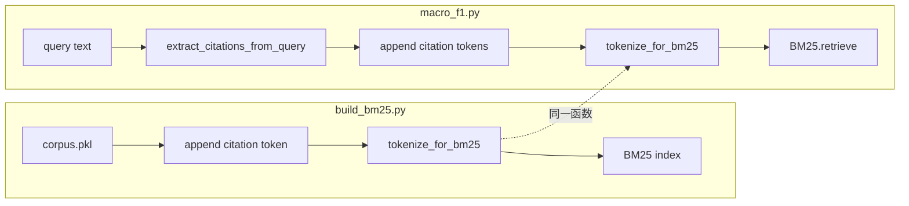

# BM25 德语预处理方案

## 背景

当前 [`src/indexing/build_bm25.py`](src/indexing/build_bm25.py) 仅调用默认 `bm25s.tokenize()`：

```32:35:src/indexing/build_bm25.py
    # Tokenize (lowercase whitespace split; no stemming to preserve legal abbreviations)
    print("Tokenizing ...")
    tracemalloc.start()
    tokenized = bm25s.tokenize(indexed_texts, show_progress=True)
```

`bm25s.tokenize` 已内置所需能力（`lower`、`stopwords`、`stemmer`），无需自写分词逻辑。但**索引与查询必须使用完全相同的参数**，否则检索会失效。

当前 [`src/eval/macro_f1.py`](src/eval/macro_f1.py) 第 107 行也用默认 `bm25s.tokenize([query])`，两处必须同步修改。



## 预处理流水线（4 步）

| 步骤 | 操作 | 说明 |
|------|------|------|
| 1 | 小写 | `lower=True` |
| 2 | 德语停用词 | `stopwords="german"` |
| 3 | Snowball 词干化 | PyStemmer `Stemmer("german")` |
| 4 | **追加 citation 原子 token** | 每条文档/查询在分词结果末尾追加完整 citation |

第 4 步的目的：`indexed_text` 里 citation 经正则拆分、停用词过滤、词干化后会打散（如 `Art. 221 Abs. 1 StPO` → 多个 stem），无法作为整体参与 BM25 匹配。将 citation 规范化为**单个 token** 追加到末尾，可保留精确引用匹配能力。

## 实现步骤

### 1. 新增共享预处理模块

新建 [`src/indexing/bm25_tokenize.py`](src/indexing/bm25_tokenize.py)：

```python
import re
import bm25s
import Stemmer

_GERMAN_STEMMER = Stemmer.Stemmer("german")

def citation_to_token(citation: str) -> str:
    """将 citation 规范化为单个 BM25 token（小写，空白/点号 → 下划线）。"""
    s = citation.lower().strip()
    s = re.sub(r"[\s.]+", "_", s).strip("_")
    return s
    # 例: "Art. 221 Abs. 1 StPO" → "art_221_abs_1_stpo"
    #     "BGE 137 IV 122 E. 6.2" → "bge_137_iv_122_e_6_2"

def _append_citation_tokens(
    tokenized: bm25s.tokenization.Tokenized,
    citations_per_doc: list[list[str]],
) -> bm25s.tokenization.Tokenized:
    """在 bm25s 分词结果末尾追加未 stem 的 citation 原子 token。"""
    for doc_ids, citations in zip(tokenized.ids, citations_per_doc):
        for citation in citations:
            tok = citation_to_token(citation)
            if not tok:
                continue
            if tok not in tokenized.vocab:
                tokenized.vocab[tok] = len(tokenized.vocab)
            doc_ids.append(tokenized.vocab[tok])
    return tokenized

def tokenize_for_bm25(
    texts: str | list[str],
    *,
    citations: list[str] | list[list[str]] | None = None,
    show_progress: bool = True,
) -> bm25s.tokenization.Tokenized:
    if isinstance(texts, str):
        texts = [texts]

    tokenized = bm25s.tokenize(
        texts,
        lower=True,
        stopwords="german",
        stemmer=_GERMAN_STEMMER,
        show_progress=show_progress,
    )

    if citations is None:
        return tokenized

    # 统一为 list[list[str]]：建索引时每 doc 一个 citation；查询侧可传多个
    if citations and isinstance(citations[0], str):
        citations_per_doc = [citations]  # type: ignore[list-item]
    else:
        citations_per_doc = citations  # type: ignore[assignment]

  # 与 texts 等长；单条查询时 citations_per_doc 长度为 1
    _append_citation_tokens(tokenized, citations_per_doc)
    return tokenized
```

要点：
- citation token **在 stem 之后追加**，不经词干化，避免 `BGE`/`StPO` 等被改写
- `citation_to_token` 用下划线连接，确保 `\b\w\w+\b` 视为一个词，不被拆开
- 建索引与查询使用同一 `citation_to_token` 规则，保证 token 对齐

### 2. 更新建索引脚本

修改 [`src/indexing/build_bm25.py`](src/indexing/build_bm25.py)：
- 除 `indexed_text` 外，提取 `citations = [doc["citation"] for doc in corpus]`
- 调用 `tokenize_for_bm25(indexed_texts, citations=citations, show_progress=True)`
- 更新注释

### 3. 更新检索/评估脚本

修改 [`src/eval/macro_f1.py`](src/eval/macro_f1.py) 中 `retrieve_bm25()`：
- 导入 `tokenize_for_bm25`
- 先用已有 `extract_citations_from_query(query)` 提取 query 内嵌 citation
- 调用 `tokenize_for_bm25([query], citations=[query_extracted], show_progress=False)`
- 保留现有「将 extracted citations prepend 到结果」逻辑不变（与 BM25 token 增强互补）

## 不在本次范围内

- **依赖安装**：需自行安装 `PyStemmer`（`pip install PyStemmer`），不创建 `requirements.txt`，不纳入 todo
- **索引重建 / 评估运行**：代码改完后由你自行决定何时跑 `build_bm25.py` 或 `macro_f1.py`，agent 不执行
- **不修改** [`src/indexing/build_corpus.py`](src/indexing/build_corpus.py)：`indexed_text` 保持原始文本，预处理仅在 BM25 分词阶段进行
- **不持久化** stemmer / citation 规则到索引目录：共享 `tokenize_for_bm25` 是唯一可靠方式

## 风险与预期

| 项 | 说明 |
|----|------|
| 索引/查询不一致 | 共享 `tokenize_for_bm25` + `citation_to_token` 规避 |
| citation token 与正文 token 重复 | `indexed_text` 已含 citation 文本，正文侧可能已有 `art`、`221` 等；末尾原子 token 是额外信号，不冲突 |
| 英文 query + 德文 corpus | 英文词经德语 Snowball 处理可能不理想；query 内嵌 citation 经第 4 步可精确匹配 |
| 需重建索引 | 改代码后旧 `indexes/bm25/` 不兼容，使用前需自行重跑 `build_bm25.py` |
