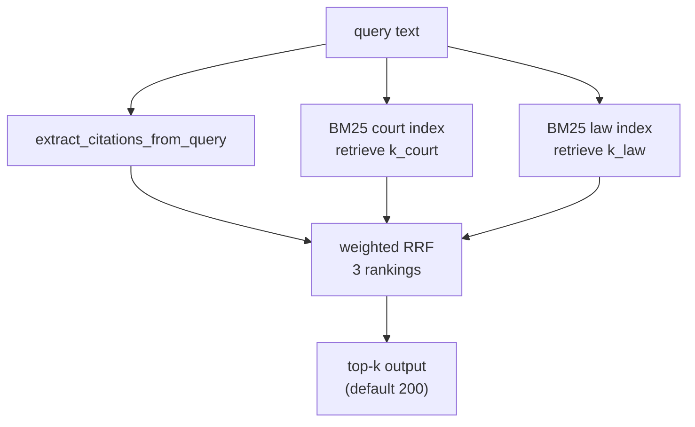

# BM25 分路召回 + 加权 RRF 融合设计

**日期:** 2026-06-19  
**状态:** 已实现  
**目标:** 将 BM25 召回改为 court / law 分路独立 top-k，query 正则提取作为第三路，三路加权 RRF 融合后输出固定条数候选。

---

## 背景

当前 `src/retrieval/bm25.py` 使用单一统一 BM25 索引，一次 `retrieve(k=200)` 取全局 top-k。语料中 court 文档约 247 万、law 文档约 17.6 万（占比 ~6.6%），统一 top-k 容易被 court 结果占满，law 类 gold citation 召回不足。

query/eval 已解耦（`src/query/run.py` → predictions CSV → `src/eval/macro_f1.py`），本次改动集中在检索层和索引构建，eval 侧不变。

---

## 已确认决策

| 决策点 | 选择 |
|--------|------|
| 融合方式 | 加权 RRF（Reciprocal Rank Fusion） |
| 检索路数 | 3 路：court BM25、law BM25、query 正则提取 |
| 索引架构 | 双索引（`bm25_court/` + `bm25_law/`） |
| query 提取 citation | 作为第三路 ranking 参与加权 RRF |
| law vs court 权重 | law 略高于 court |
| 最终输出条数 | 保留 `k` 参数，默认 200；后续由独立 selector 决定保留条数 |
| 各路召回深度 | 独立参数 `k_court`、`k_law`，默认各 300 |

---

## 架构



### 模块职责

| 模块 | 路径 | 职责 |
|------|------|------|
| RRF 融合 | `src/retrieval/rrf.py` | `weighted_rrf()` 纯函数 |
| BM25 检索 | `src/retrieval/bm25.py` | 双索引加载、三路召回、调 RRF |
| 索引构建 | `src/indexing/build_bm25.py` | 按 source 构建两个 BM25 索引 |
| Query CLI | `src/query/run.py` | 暴露 k / 权重 CLI 参数 |

---

## 加权 RRF

公式（与 `spec.md` 一致，每路乘以权重）：

```
score(c) += weight / (rrf_k + rank + 1)
```

按 RRF 分数降序排列，取前 `k` 条 citation 作为输出。

### 默认权重

| 路 | 参数名 | 默认值 | 理由 |
|----|--------|--------|------|
| query_extracted | `weight_extracted` | 2.0 | 精确嵌入 citation，命中率最高 |
| law_bm25 | `weight_law` | 1.2 | law 文档少，略提权避免被 court 淹没 |
| court_bm25 | `weight_court` | 1.0 | 基准 |

### 默认参数

| 参数 | 默认值 | 含义 |
|------|--------|------|
| `k_court` | 300 | court 路 BM25 召回深度 |
| `k_law` | 300 | law 路 BM25 召回深度 |
| `k` | 200 | RRF 融合后输出条数 |
| `rrf_k` | 60 | RRF 平滑常数（与 spec.md 一致） |

所有参数通过 CLI 暴露，均有默认值。

---

## 索引层

### 目录结构

```
indexes/
├── bm25_court/    # source == "court" 的文档
├── bm25_law/      # source == "law" 的文档
├── corpus.pkl     # 不变，仍含全部文档及 source 元数据
└── citation_to_idx.pkl
```

### 构建流程

`build_bm25.py` 从 `corpus.pkl` 按 `source` 字段过滤：

1. `court_docs = [d for d in corpus if d["source"] == "court"]`
2. `law_docs   = [d for d in corpus if d["source"] == "law"]`
3. 分别 tokenize（`tokenize_for_bm25`）并构建 BM25 索引
4. 保存到 `indexes/bm25_court/` 和 `indexes/bm25_law/`

每个子索引的文档序号是子集内的局部 index；检索结果通过子集 corpus 列表映射回 `citation` 字符串。

旧的 `indexes/bm25/` 统一索引废弃，不再使用。

---

## 检索流程（`retrieve_bm25`）

```python
def retrieve_bm25(
    query: str,
    k: int = 200,
    k_court: int = 300,
    k_law: int = 300,
    weight_extracted: float = 2.0,
    weight_law: float = 1.2,
    weight_court: float = 1.0,
    rrf_k: int = 60,
) -> list[str]:
```

步骤：

1. `extracted = extract_citations_from_query(query)` — 第三路 ranking（按提取顺序 rank 0, 1, 2...）
2. tokenize query（含 extracted citation tokens）
3. `_retriever_court.retrieve(tokenized_q, k=k_court)` → court citations 列表
4. `_retriever_law.retrieve(tokenized_q, k=k_law)` → law citations 列表
5. `weighted_rrf([(extracted, w_ext), (court_cits, w_court), (law_cits, w_law)], rrf_k)` → 排序后的 citation 列表
6. 返回前 `k` 条

---

## CLI 接口（`src/query/run.py`）

```bash
conda run -n agent python src/query/run.py
conda run -n agent python src/query/run.py \
  --k-court 300 --k-law 300 --k 200 \
  --weight-extracted 2.0 --weight-law 1.2 --weight-court 1.0
```

| 参数 | 默认值 | 说明 |
|------|--------|------|
| `--input` | `dataset/val.csv` | 输入 query 文件 |
| `--output` | `results/predictions.csv` | 输出 predictions 文件 |
| `--k-court` | `300` | court BM25 召回深度 |
| `--k-law` | `300` | law BM25 召回深度 |
| `--k` | `200` | RRF 后最终输出条数 |
| `--weight-extracted` | `2.0` | query 提取路 RRF 权重 |
| `--weight-law` | `1.2` | law BM25 路 RRF 权重 |
| `--weight-court` | `1.0` | court BM25 路 RRF 权重 |
| `--rrf-k` | `60` | RRF 平滑常数 |

`predict_citations()` 签名同步扩展，透传上述参数。

---

## 错误处理

| 场景 | 行为 |
|------|------|
| `indexes/bm25_court/` 或 `bm25_law/` 不存在 | 报错退出，提示运行 `build_bm25.py` |
| 某路召回为空（如无 extracted citation） | 该路不参与 RRF，其余路正常融合 |
| 某 citation 同时出现在多路 | RRF 分数累加（正常行为） |
| RRF 后候选数 < k | 返回全部候选，不 padding |

---

## 验证

1. **单元测试** `weighted_rrf`：多路输入、权重、去重累加、排序正确性
2. **索引构建**：`build_bm25.py` 在 sample corpus 上产出两个索引目录
3. **端到端**：`query/run.py` → `eval/macro_f1.py` 在 val 上跑通；与旧 baseline 数值不同属预期（行为已变）

---

## 不在本次范围

- 动态计算最终保留条数的 selector
- embedding 第四路 RRF
- Recall@k 诊断脚本
- 保留旧 `indexes/bm25/` 统一索引的向后兼容

---

## 文件变更清单

| 操作 | 路径 |
|------|------|
| 新建 | `src/retrieval/rrf.py` |
| 新建 | `tests/retrieval/test_rrf.py` |
| 修改 | `src/retrieval/bm25.py` |
| 修改 | `src/indexing/build_bm25.py` |
| 修改 | `src/query/run.py` |
| 修改 | `docs/plan/README.md`（索引行） |
