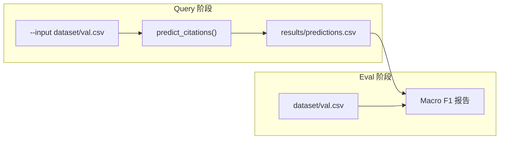

# Query / Eval 解耦设计

**日期:** 2026-06-19  
**状态:** 已实现  
**目标:** 将 query 流程与 eval 评估解耦，通过固定格式的 predictions CSV 作为两者之间的唯一接口。

---

## 背景

当前 `src/eval/macro_f1.py` 将检索（BM25）、指标计算、端到端评估耦合在同一文件。随着 pipeline 演进（Reranker、Selector），需要：

1. Query 阶段独立运行，输出可复用的预测文件
2. Eval 阶段只读预测结果，与检索实现无关
3. 支持对比不同 run 的 predictions，无需重复检索

---

## 已确认决策

| 决策点 | 选择 |
|--------|------|
| `predicted_citations` 语义 | 最终提交引用列表（与 Kaggle submission 一致） |
| Eval 主指标 | Macro F1（含逐条 P/R/F1 明细）；不单独报 recall，不做 Recall@k |
| Gold 来源 | 固定 `dataset/val.csv` 的 `gold_citations` |
| Query 输入 | CLI `--input`，默认 `dataset/val.csv` |
| Query 输出 | 默认 `results/predictions.csv`，`--output` 可覆盖 |
| Eval 输入 | 默认 `results/predictions.csv`，`--predictions` 可覆盖 |
| 代码结构 | 方案 A：按职责拆模块 |

---

## 架构



### 模块职责

| 模块 | 路径 | 职责 |
|------|------|------|
| BM25 检索 | `src/retrieval/bm25.py` | 索引加载、citation regex 提取、BM25 检索 |
| Query CLI | `src/query/run.py` | 读 input CSV → 调 pipeline → 写 predictions CSV |
| Eval | `src/eval/macro_f1.py` | 纯指标函数 + eval CLI，零检索依赖 |

Query pipeline 通过 `predict_citations(query) -> list[str]` 函数抽象。当前 baseline 实现为 BM25 top-k（默认 k=200，与现有 `macro_f1.py` 默认 CLI 行为一致）；后续 Reranker/Selector 只改此函数，输出格式不变。

---

## 数据格式

### predictions.csv

与 `dataset/sample_submission.csv` 一致：

```csv
query_id,predicted_citations
val_001,"Art. 221 Abs. 1 StPO;Art. 140 Abs. 1 StGB;..."
val_002,"Art. 8 Abs. 1 ATSG;Art. 17 Abs. 1 IVG"
```

规则：

- 列名固定：`query_id`, `predicted_citations`
- citation 之间用 `;` 分隔（读取时对每项 `.strip()`）
- 含逗号或特殊字符的字段用 CSV 标准引号包裹（使用 Python `csv` 模块读写）
- 空预测：字段留空字符串，该条 F1 = 0

### Query 输入 CSV

最少需要列：`query_id`, `query`。若含 `gold_citations` 列，query 侧忽略。

兼容 `dataset/val.csv` 和 `dataset/test.csv`。

### Gold CSV（eval 侧）

固定读取 `dataset/val.csv`，使用 `query_id` 与 `gold_citations` 列。eval 按 val.csv 中的 query_id 顺序逐条对齐。

---

## CLI 接口

### Query

```bash
conda run -n agent python src/query/run.py
conda run -n agent python src/query/run.py --input dataset/val.csv --output results/predictions.csv
conda run -n agent python src/query/run.py --input dataset/test.csv --output results/test_predictions.csv
```

| 参数 | 默认值 | 说明 |
|------|--------|------|
| `--input` | `dataset/val.csv` | 输入 query 文件 |
| `--output` | `results/predictions.csv` | 输出 predictions 文件 |
| `--k` | `200` | BM25 baseline 取前 k 条作为最终预测 |

### Eval

```bash
conda run -n agent python src/eval/macro_f1.py
conda run -n agent python src/eval/macro_f1.py --predictions results/predictions.csv
conda run -n agent python src/eval/macro_f1.py --predictions results/pred_k50.csv --output results/eval_report.txt
```

| 参数 | 默认值 | 说明 |
|------|--------|------|
| `--predictions` | `results/predictions.csv` | 输入 predictions 文件 |
| `--output` | 无（仅打印到 stdout） | 可选，保存文本报告 |

---

## Eval 输出格式

去掉 Recall@k，保留逐条明细与聚合：

```
query_id     | gold | pred | tp | precision | recall | f1       | missed (first 3)
val_001      |   42 |  100 |  8 |    0.0800 | 0.1905 |   0.1127 | [BGE 132 I 21 E. 3.2, ...]
...
AGGREGATE    |      |      |    |           |        |   0.0842 |
```

Macro F1 = 各条 F1 的算术平均（与 Kaggle 评分逻辑一致）。

---

## 错误处理

| 场景 | 行为 |
|------|------|
| predictions 缺少 val 中某个 query_id | 报错退出，列出缺失 id |
| predictions 多出 val 没有的 query_id | 打印警告，忽略多余行 |
| `predicted_citations` 为空 | 正常处理，该条 F1 = 0 |
| query 输入缺少 `query_id` 或 `query` 列 | 报错退出 |
| `results/` 目录不存在 | 自动创建 |

---

## 迁移计划

从现有 `src/eval/macro_f1.py` 拆分：

1. **新建 `src/retrieval/bm25.py`**  
   迁出：`extract_citations_from_query`, `_load_index`, `retrieve_bm25` 及相关常量/imports。

2. **新建 `src/query/run.py`**  
   - `predict_citations(query, k) -> list[str]`：baseline 为 `retrieve_bm25(query, k=k)`
   - `format_citations(citations) -> str`：`"; ".join(citations)`
   - CLI：读 input → 逐条预测 → 写 output

3. **重构 `src/eval/macro_f1.py`**  
   - 保留：`_query_f1`, `compute_macro_f1`, `parse_citations`（新增）
   - 新增：`load_predictions(path)`, `load_gold(path)`, `evaluate_predictions(predictions_path)`
   - 删除：所有 BM25/检索相关代码
   - CLI 改为读 predictions + val gold

4. **更新 `.gitignore`**  
   增加 `results/`

5. **验证**  
   query → eval 端到端 Macro F1 应与重构前 `macro_f1.py` 直接运行结果一致（baseline k=200）。

---

## 典型工作流

```bash
# 跑 query
conda run -n agent python src/query/run.py

# 评估
conda run -n agent python src/eval/macro_f1.py

# 对比不同 run
conda run -n agent python src/query/run.py --output results/pred_v2.csv
conda run -n agent python src/eval/macro_f1.py --predictions results/pred_v2.csv
```

---

## 不在本次范围

- Recall@k 诊断脚本（若需要，后续独立为 `src/eval/recall_at_k.py`）
- Reranker / Selector pipeline 实现
- Query rewriting
- 对 `dataset/test.csv` 的 eval（无 gold，仅产出 submission）

---

## 文件变更清单

| 操作 | 路径 |
|------|------|
| 新建 | `src/retrieval/bm25.py` |
| 新建 | `src/query/run.py` |
| 重构 | `src/eval/macro_f1.py` |
| 修改 | `.gitignore`（加 `results/`） |
