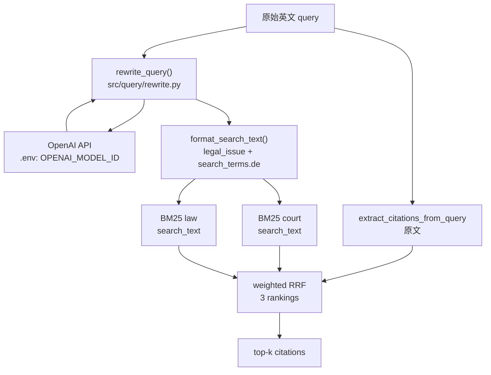

# LLM Query Rewrite 设计

**日期:** 2026-06-19  
**状态:** 已实现  
**目标:** 在 query pipeline 第一步加入依赖 LLM 的 query rewrite，将英文法律问题转为 spec §7.1 结构化输出，当前仅用 `search_terms.de` 增强德文 BM25 召回。

---

## 背景

当前 `src/query/run.py` 将英文 query 直接传入 `retrieve_bm25()`。BM25 索引基于德文语料（court / law 双索引 + 加权 RRF），英文 query 的跨语言词面匹配弱，召回主要依赖 query 内嵌的 citation 字符串（如 `Art. 221 Abs. 1 StPO`）。

`spec.md` §7.1 已规划 Query Analyzer / Query Rewriter：理解英文法律问题，生成德/法检索词及 `expected_codes`。query/eval 已解耦，本次改动集中在 query pipeline 与检索层输入，eval 侧与 predictions CSV 格式不变。

---

## 已确认决策

| 决策点 | 选择 |
|--------|------|
| 输出 schema | 完整 spec §7.1（`legal_issue`、`expected_codes`、`search_terms.de/fr`） |
| 当前检索使用 | 仅 `search_terms.de`（+ `legal_issue`）喂 BM25；`fr` / `expected_codes` 预留后续 Hybrid Retriever |
| LLM 接口 | OpenAI 兼容 API（`openai` SDK），读根目录 `.env` |
| 环境变量 | `OPENAI_API_KEY`、`OPENAI_BASE_URL`、`OPENAI_MODEL_ID` |
| BM25 输入 | 德文检索词做 BM25 tokenize；citation 正则提取仍用**原始英文 query** |
| 缓存 | 不缓存，每次 query run 实时调 LLM |
| 代码结构 | 方案 2：`src/llm/client.py` + `src/query/rewrite.py` |
| rewrite 失败 | 报错退出，不 silent fallback 到原文 |

---

## 架构



### 模块职责

| 模块 | 路径 | 职责 |
|------|------|------|
| LLM Client | `src/llm/client.py` | 加载 `.env`、封装 `chat_json()` |
| Query Rewriter | `src/query/rewrite.py` | prompt、`RewriteResult`、schema 校验、`format_search_text()` |
| BM25 检索 | `src/retrieval/bm25.py` | 新增 `search_text` 参数，分离 citation 提取与检索文本 tokenize |
| Query CLI | `src/query/run.py` | 默认开启 rewrite；`--no-rewrite` 跳过 |

---

## Rewrite 输出 Schema

对齐 `spec.md` §7.1：

```json
{
  "legal_issue": "wesentlicher Irrtum / Grundlagenirrtum",
  "expected_codes": ["OR"],
  "search_terms": {
    "de": [
      "wesentlicher Irrtum",
      "Grundlagenirrtum",
      "Irrtum Vertrag",
      "Vertragsanfechtung Irrtum"
    ],
    "fr": [
      "erreur essentielle",
      "vice du consentement"
    ]
  }
}
```

### `RewriteResult` 数据结构

```python
@dataclass
class RewriteResult:
    legal_issue: str
    expected_codes: list[str]
    search_terms: dict[str, list[str]]  # {"de": [...], "fr": [...]}
```

### Schema 校验规则

| 字段 | 类型 | 必填 | 校验 |
|------|------|------|------|
| `legal_issue` | str | 是 | 非空 |
| `expected_codes` | list[str] | 是 | 可为空列表 |
| `search_terms` | dict | 是 | 必须含 `de` key |
| `search_terms.de` | list[str] | 是 | 非空 |
| `search_terms.fr` | list[str] | 否 | 缺失时视为 `[]` |

### 检索文本格式化

将 `RewriteResult` 转为检索用的纯文本，与具体检索后端（BM25 / dense embedding）解耦：

```python
def format_search_text(result: RewriteResult, lang: str = "de") -> str:
    """Join legal_issue + search_terms[lang] into a single search string."""
    parts = list(result.search_terms.get(lang, []))
    if result.legal_issue:
        parts = [result.legal_issue] + parts
    return " ".join(parts)
```

- 当前 pipeline 调用 `format_search_text(result, lang="de")` 喂 BM25
- 后续 dense retriever 可复用同一函数（或按语言取 `search_terms[lang]` 列表逐条 embedding）
- **不做**小写、去停词、stemming；这些由 `tokenize_for_bm25()` 在 BM25 检索时统一处理

### Prompt 输出要求

LLM 应输出自然、规范的德文法律术语，**不要**预做小写、词干化或手动去停词。

---

## LLM Client（`src/llm/client.py`）

```python
def chat_json(system: str, user: str) -> dict:
    """Call OpenAI-compatible API, return parsed JSON dict."""
```

- 使用 `python-dotenv` 在模块加载时读取根目录 `.env`
- 使用 `openai` SDK，`OpenAI(api_key=..., base_url=...)`
- 调用 `client.chat.completions.create(..., response_format={"type": "json_object"})`
- 返回 `json.loads(response.choices[0].message.content)`
- `OPENAI_API_KEY`、`OPENAI_BASE_URL`、`OPENAI_MODEL_ID` 任一缺失时 `raise RuntimeError`

---

## Prompt 策略（`src/query/rewrite.py`）

**System prompt 要点：**

- 角色：瑞士法律检索助手
- 任务：分析英文法律问题，输出 JSON
- `search_terms.de`：5–10 个德文法律检索短语（瑞士德语法律术语）
- `search_terms.fr`：3–5 个法文法律检索短语
- `expected_codes`：可能涉及的瑞士法典缩写（如 `StPO`、`StGB`、`OR`、`ZGB`、`ATSG`、`IVG`）
- `legal_issue`：核心法律问题的德文表述
- 严格要求输出合法 JSON，字段名与 schema 一致

**User prompt：** 直接传入原始英文 query 全文。

---

## 检索层变更（`retrieve_bm25`）

```python
def retrieve_bm25(
    query: str,                          # 用于 citation 正则提取（原文）
    search_text: str | None = None,      # 用于 BM25 tokenize；None 时 fallback 到 query
    k: int = 200,
    k_court: int = 300,
    k_law: int = 300,
    weight_extracted: float = 2.0,
    weight_law: float = 1.2,
    weight_court: float = 1.0,
    rrf_k: int = 60,
) -> list[str]:
```

步骤变更：

1. `extracted = extract_citations_from_query(query)` — 始终从**原文**提取
2. `text_for_search = search_text if search_text is not None else query`
3. `tokenize_for_bm25([text_for_search], citations=[extracted], ...)` — BM25 两路用 rewrite 德文文本
4. 其余 RRF 融合逻辑不变

---

## Query Pipeline 变更（`src/query/run.py`）

```python
def predict_citations(
    query: str,
    use_rewrite: bool = True,
    ...
) -> list[str]:
    search_text = None
    if use_rewrite:
        result = rewrite_query(query)
        search_text = format_search_text(result, lang="de")
    return retrieve_bm25(query, search_text=search_text, ...)
```

`run()` 循环中若指定 `--rewrite-log`，在调用 `rewrite_query()` 后将 `{query_id}.json` 写入该目录（`run.py` 持有 `query_id`，不在 `predict_citations` 内写日志）。

默认行为：**开启 rewrite**。加 `--no-rewrite` 时行为等同当前 baseline（原文直接检索）。

### CLI 新增参数

| 参数 | 默认值 | 说明 |
|------|--------|------|
| `--no-rewrite` | off（即默认开启 rewrite） | 跳过 LLM，直接用原文检索 |
| `--rewrite-log` | 无 | 可选，将每条 rewrite JSON 写入指定目录（调试，非缓存） |

原有 `--k`、`--k-court`、`--k-law`、权重参数保持不变。

---

## 错误处理

| 场景 | 行为 |
|------|------|
| `.env` 缺失或 env 变量未设置 | 报错退出（仅 `--no-rewrite` 模式可不依赖 LLM） |
| API 调用失败（网络/鉴权/超时） | 打印错误到 stderr，`raise` 终止 |
| 返回非合法 JSON | 同上 |
| Schema 校验失败（缺 `de`、空 `de` 等） | 同上，打印原始 JSON 便于调试 |
| `--no-rewrite` | 跳过 LLM，不读 `.env` 中的 model 配置 |

---

## 依赖

安装到 conda `agent` 环境：

```
openai
python-dotenv
```

`.env` 已在 `.gitignore` 中，不入库。

---

## 测试与验证

### 单元测试（`tests/query/test_rewrite.py`）

使用 mock，不调用真实 API：

1. `parse_rewrite_result` — 合法 JSON、缺 `de`、空 `de`、缺 `fr`（应通过）
2. `format_search_text` — 拼接 `legal_issue` + `de` 词；`lang` 参数路由
3. `rewrite_query` — mock `chat_json`，验证解析流程

### 集成验证

```bash
# baseline（无 rewrite）
conda run -n agent python src/query/run.py --no-rewrite --output results/pred_no_rewrite.csv
conda run -n agent python src/eval/macro_f1.py --predictions results/pred_no_rewrite.csv

# with rewrite
conda run -n agent python src/query/run.py --output results/pred_rewrite.csv
conda run -n agent python src/eval/macro_f1.py --predictions results/pred_rewrite.csv
```

对比 Macro F1；可用 `--rewrite-log results/rewrite_logs/` 人工抽查德文词质量。

---

## 不在本次范围

- Rewrite 结果缓存
- 法文 BM25 索引及 `search_terms.fr` 的实际检索使用
- `expected_codes` 驱动的 statute exact lookup
- Rewrite prompt 调优 / few-shot 示例
- 微调 rewrite LLM
- eval 侧改动

---

## 文件变更清单

| 操作 | 路径 |
|------|------|
| 新建 | `src/llm/__init__.py` |
| 新建 | `src/llm/client.py` |
| 新建 | `src/query/rewrite.py` |
| 修改 | `src/query/run.py` |
| 修改 | `src/retrieval/bm25.py` |
| 新建 | `tests/query/test_rewrite.py` |
