# Swiss Legal Citation Retrieval System Spec

## 1. 项目背景

本项目接收英文法律问题查询，输出与该问题相关的瑞士法律文献引用列表。引用对象主要包括瑞士联邦法律条文、联邦法院判决及其具体考量部分。

任务特点包括：

- 查询语句为英文。
- 法律文献和引用标注通常为德文，也可能涉及法文、意大利文（跨语言任务）。
- 输出不是自然语言答案，而是法律引用列表。
- 引用必须准确、可验证、格式统一。
- 系统需要尽量避免生成不存在或格式错误的法律引用。
- 竞赛名称强调"Agentic"，允许且鼓励迭代检索、自我修正等 Agent 式设计。

**数据规模约束（影响架构选型）：**


| 数据                    | 规模                                 | 语言           |
| --------------------- | ---------------------------------- | ------------ |
| 法院判决考量（检索语料）          | ~247 万条                            | DE / FR / IT |
| 联邦法律条文（检索语料）          | ~1.52 万条                           | DE           |
| 验证集（含 gold citations） | 10 条 query                         | EN           |
| 测试集                   | 40 条 query（20 public + 20 private） | EN           |
| 训练集（LEXam）            | 4,886 条                            | EN / DE      |


注意：测试集极小（40 条），意味着每条 query 的 F1 权重极高，单条 query 的 citation 遗漏或错误对最终得分影响显著。

---

## 2. 任务定义

### 2.1 输入

系统输入为一条英文法律查询语句。

示例：

```text
Under what conditions can a contract be rescinded for mistake under Swiss law?
```

输入字段可抽象为：

```json
{
  "query_id": "test_001",
  "query": "Under what conditions can a contract be rescinded for mistake under Swiss law?"
}
```

其中：

- `query_id`：查询编号，可选。
- `query`：英文法律问题，是系统的主要输入。

---

### 2.2 输出

系统输出为一个以分号分隔的瑞士法律引用列表。

示例：

```text
Art. 23 OR; Art. 24 OR; BGE 136 III 528 E. 3.4.1
```

输出字段可抽象为：

```json
{
  "query_id": "test_001",
  "citations": "Art. 23 OR; Art. 24 OR; BGE 136 III 528 E. 3.4.1"
}
```

输出要求：

- 只输出引用，不输出解释。
- 多个引用之间使用英文分号 `;` 分隔。
- 引用应使用标准化 canonical form。
- 不应生成候选语料中不存在的引用。
- 不应输出自然语言回答。
- 不应输出 Markdown 列表、编号列表或额外说明。

---

## 3. 数据来源

项目使用三类数据。

### 3.1 训练集

训练集来自 LEXam 开放式法律问题数据。

训练数据包含：

- 英文法律问题。
- 参考答案。
- 答案中出现的法律引用。

需要从答案字段中抽取 gold citations，作为监督信号。

示例训练样本：

```json
{
  "query": "When is a mistake legally relevant in Swiss contract law?",
  "answer": "... according to Art. 23 OR and Art. 24 OR ...",
  "gold_citations": [
    "Art. 23 OR",
    "Art. 24 OR"
  ]
}
```

---

### 3.2 测试集

测试集仅包含英文查询语句。

示例：

```json
{
  "query_id": "test_001",
  "query": "Can an employee claim compensation for unjustified termination?"
}
```

系统需要为每个测试查询预测引用列表。

---

### 3.3 检索语料库

检索语料库包括瑞士联邦法律和联邦法院判决考量，总规模约 248 万文档。


| 语料类型        | 规模           | 语言           | 示例                         |
| ----------- | ------------ | ------------ | -------------------------- |
| 联邦法律条文      | ~15,200 条    | DE           | `Art. 23 OR`、`Art. 8 ZGB`  |
| 联邦法院判决考量    | ~2,470,000 条 | DE / FR / IT | `BGE 136 III 528 E. 3.4.1` |
| 联邦法院判决（案件级） | —            | DE / FR / IT | `BGE 136 III 528`          |


注意：

- 语料主体（99%+）为法院判决考量，是检索的主要难点。
- 考量（Erwägung / Considérant）是判决书中的论证段落，粒度细于案件本身。
- `BGE 136 III 528 E. 3.4.1` 与 `BGE 136 III 528` 是两个不同的 canonical citation，评分时精确字符串匹配，**不可混用**。
- 语料规模决定必须使用专用向量数据库（Faiss / Qdrant / Milvus），不可直接在内存中暴力检索。

---

## 4. 引用类型

系统需要支持至少以下几类引用。

### 4.1 法律条文引用

示例：

```text
Art. 23 OR
Art. 24 Abs. 1 OR
Art. 8 ZGB
Art. 29 Abs. 2 BV
Art. 97 ff. OR
```

需要识别的字段包括：

```json
{
  "type": "statute",
  "article": "23",
  "paragraph": null,
  "code": "OR",
  "canonical": "Art. 23 OR"
}
```

---

### 4.2 判例引用

示例：

```text
BGE 136 III 528
BGE 136 III 528 E. 3.4.1
BGE 129 III 363 E. 5.3
```

需要识别的字段包括：

```json
{
  "type": "case",
  "court": "BGE",
  "volume": "136",
  "division": "III",
  "page": "528",
  "consideration": "3.4.1",
  "canonical": "BGE 136 III 528 E. 3.4.1"
}
```

---

### 4.3 非 BGE 判决引用

示例：

```text
BGer 4A_123/2020
Urteil des Bundesgerichts 4A_123/2020
```

需要根据语料实际格式进一步规范。

---

## 5. 系统目标

系统核心目标是：对于每个英文法律问题，找出最相关的瑞士法律引用，并以规范格式输出。

### 5.1 竞赛主评估指标

**Macro F1（Exact String Match）**：竞赛唯一排名指标。

$$\text{Macro F1} = \frac{1}{N} \sum_{i=1}^{N} F1_i$$

其中每条 query 的 F1 计算基于**精确字符串匹配**：

```python
gold = {"Art. 23 OR", "BGE 136 III 528 E. 3.4.1"}
pred = {"Art. 23 OR", "BGE 136 III 528"}  # 注意：BGE 案件级与 E. 级不同
# precision = 1/2, recall = 1/2, F1 = 0.5（即使内容接近也按 0.5 计算）
```

关键含义：

- Citation canonicalization（规范化）是先决条件，格式错误直接得 0 分。
- `BGE 136 III 528` 和 `BGE 136 III 528 E. 3.4.1` 是不同的 citation，不可替代。
- MAP、MRR 等排序指标与竞赛无关，不作为系统优化目标。

### 5.2 主要优化方向

- 提高 gold citation recall（召回阶段优先）。
- 提高 Macro F1（精排与选择阶段）。
- 降低 citation hallucination（格式校验与候选约束）。
- 保证输出格式稳定（exact canonical form）。
- 支持英文 query 到德文/法文/意大利文法律文本的跨语言匹配。
- 自适应 per-query citation count 估计（输出数量影响 F1）。

---

## 6. 系统总体架构

推荐采用检索增强 pipeline，而不是端到端生成式模型。竞赛名称强调"Agentic"，系统在基础 pipeline 之上应支持迭代检索循环。

### 6.1 基础 Pipeline

```text
Input English Query
        |
        v
Query Analyzer / Query Rewriter
        |
        v
Hybrid Retriever  ←─────────────────────────────┐
   (BM25 + Dense + Graph Expansion)              │
        |                                        │
        v                                        │
Candidate Normalizer                             │
   (去重 + canonical form + 粒度保护)             │
        |                                        │
        v                                        │
Reranker                                         │
   (Cross-encoder / LTR 多信号融合)               │
        |                                        │
        v                                        │
Citation Selector  ──── "候选不足？" ────────────┘
   (自适应 count 估计 + constrained selection)    （迭代检索，可选）
        |
        v
Rule-based Formatter
        |
        v
Semicolon-separated Citation List
```

### 6.2 Agentic 迭代机制（可选增强）

Citation Selector 可判断当前候选是否充分，触发第二轮检索：

```text
Round 1: 检索 top-200 候选 → Selector 输出初步引用
  ↓ 若 Selector 判断"需要更多法条/判例"
Round 2: 以已选引用为 pivot 扩展 Citation Graph → 补充候选
  ↓ Selector 最终选择
Final Output
```

非 Agentic 的简化版本：Citation Selector 直接从 Round 1 候选中选择，无反馈循环。

### 6.3 当前 Query Pipeline（已实现）

入口：`src/query/run.py` → `predict_citations()`。以下数量以 **CLI 默认值** 为准（可通过参数覆盖）；带 `~` 的为 query 相关变量，`≤` 为硬上限。

```mermaid
flowchart TD
    IN["输入 query<br/>1 条英文法律问题"] --> RW

  subgraph rewrite ["① Query Rewrite（--no-rewrite 跳过）"]
    RW["rewrite_query()"] --> RW_OUT["RewriteResult<br/>+ search_text（德文检索串）"]
  end

  RW_OUT --> BM25

  subgraph retrieval ["② 多路检索"]
    BM25["retrieve_bm25_parts()"] --> BM25_OUT["extracted ≤~5<br/>bm25_court ≤300<br/>bm25_law ≤300"]
    BM25_OUT --> FILTER["语料校验 extracted"]
    FILTER --> DENSE["retrieve_dense_parts()<br/>（索引存在时）"]
    DENSE --> DENSE_OUT["dense_court ≤300<br/>dense_law ≤300"]
  end

  DENSE_OUT --> RRF

  subgraph fusion ["③ 融合 + 精排"]
    RRF["weighted_rrf()<br/>3~5 路加权"] --> RRF_OUT["rrf_result 去重并集<br/>通常 400~900 条<br/>rrf_scores: dict"]
    RRF_OUT --> RERANK["rerank_with_scores()<br/>（--no-rerank 跳过）"]
    RERANK --> RERANK_OUT["scored ≤100<br/>(citation, score)"]
  end

  RERANK_OUT --> SEL

  subgraph selector ["④ Selector（--no-select 跳过）<br/>src/retrieval/selector.py"]
    SEL["run_selector()"] --> BC["build_candidates()"]
    BC --> BC_OUT["Candidate ≤100"]
    BC_OUT --> CE["cheap_expand()"]
    CE --> CE_OUT["Candidate ≤100+50<br/>（每路 rescue top-10）"]
    CE_OUT --> LV["llm_verify()<br/>（--no-llm-verify 跳过）"]
    LV --> LV_OUT["top-60 打 relevance 0~3<br/>n_LLM ∈ [1,100]"]
    LV_OUT --> FS["fuse_scores()"]
    FS --> AC["adaptive_count()"]
    AC --> AC_OUT["n_final ∈ [3, 40]"]
    AC_OUT --> ASM["assemble()"]
    ASM --> ASM_OUT["citations ≥ n_final<br/>（direct_hit 可溢出）"]
  end

  RERANK_OUT -. "--no-select" .-> FALLBACK["reranked[:k]<br/>k 默认 200"]
  ASM_OUT --> FMT["format_citations()<br/>分号分隔字符串"]
  FALLBACK --> FMT
  FMT --> OUT["输出 predicted_citations<br/>1 条/ query"]
```



#### 逐步输入 / 输出数量

| 步骤 | 函数 | 输入 | 输出 | 默认参数 |
|------|------|------|------|----------|
| 0 | — | CSV 行 `{query_id, query}` | 1 条英文 query | — |
| 1 | `rewrite_query()` | 1 query | `RewriteResult`：`legal_issue`(1)、`expected_codes`(0~)、`expected_articles`(0~10)、`search_terms.de`(5~10)、`search_terms.fr`(0~5)；`format_search_text()` → 德文检索串 | `--no-rewrite` 跳过 |
| 2a | `retrieve_bm25_parts()` | query + search_text + `extra_citations`(LLM articles) | `extracted`：query 内正则抽取，通常 0~5；`bm25_court` ≤300；`bm25_law` ≤300 | `--k-court 300`、`--k-law 300` |
| 2b | 语料校验 | `extracted` | 仅保留语料库中存在的 citation（~248 万条） | `corpus.get_corpus_texts()` |
| 2c | `retrieve_dense_parts()` | search_text 或 query | `dense_court` ≤300、`dense_law` ≤300（索引存在时各一路） | 同 k_court / k_law |
| 3 | `weighted_rrf()` | 3~5 路 `(ranking, weight)` 列表 | `rrf_result`：去重并集，通常 **400~900** 条；`rrf_scores`：同 key 的 float dict | `rrf_k=60`；权重 extracted=2.0, bm25_court=1.0, bm25_law=1.2, dense_court=0.6, dense_law=1.2 |
| 4 | `rerank_with_scores()` | `rrf_result`、语料文本 | `scored`：**≤100** 个 `(citation, rerank_score∈[0,1])`，按分降序 | `--rerank-top-k 100` |
| 5a | `build_candidates()` | `scored`、rrf_scores、source_rankings | **≤100** 个 `Candidate`（挂载 source_set / direct_regex_hit 等元数据） | — |
| 5b | `cheap_expand()` | candidates + 各路 ranking | **≤100 + 50** 个 Candidate（每路 rescue 前 10 条未入池候选，`rerank_score=0`） | `rescue_top_k=10` |
| 5c | `llm_verify()` | candidates、query、语料片段 | 同数量 candidates；**top-60** 填充 `relevance`(0~3)；返回 `n_LLM`（失败时默认 10） | `--verifier-top-k 60` |
| 5d | `fuse_scores()` | candidates | 同数量，按 `final_score` 降序 | — |
| 5e | `adaptive_count()` | candidates、`n_LLM` | 标量 `n_final` ∈ **[3, 40]**：`clamp(round(0.2·n_LLM + 0.4·n_elbow + 0.4·n_rel23))` | `min=3, max=40` |
| 5f | `assemble()` | candidates、`n_final` | **≥ n_final** 条 citation 字符串（`direct_regex_hit` 可超出配额；BGE 同 parent ≤3；过滤非语料） | `max_per_parent=3` |
| 6 | `format_citations()` | citation list | 1 条 `"; "`-分隔字符串 | — |

#### 降级路径

| 开关 | 行为 | 最终输出数量 |
|------|------|--------------|
| `--no-rewrite` | 跳过 LLM rewrite；检索直接用原始 query | — |
| `--no-rerank` | 用 RRF 分代替 rerank 分，取 `rrf_result[:rerank_top_k]` | ≤100 |
| `--no-select` | 跳过 selector，直接 `scored[:k]`（语料校验后） | **≤200**（`--k` 默认 200） |
| `--no-llm-verify` | selector 内跳过 verifier；`n_LLM=10`，`n_rel23=0` | `n_final` 仍由 elbow 主导 |

#### 语料规模（检索上限背景）

| 索引 | 文档数 | 每路 top-k |
|------|--------|------------|
| BM25 court | ~247 万 | 300 |
| BM25 law | ~1.5 万 | 300 |
| Dense court / law | 同左 | 各 300 |
| 合计语料 | ~248 万 canonical citations | — |

#### 逐步详细说明

以下按数据在 pipeline 中的实际流动顺序描述。凡未特别说明的，均指 `predict_citations()` 默认开启 rewrite + rerank + selector + llm_verify 的完整路径。

**Step 0 — 批量入口与语料加载**

`run()` 从 CSV 读取 `{query_id, query}` 行，每条 query 独立调用 `predict_citations()`。启动时一次性加载 BM25 索引、Dense 索引（若存在）、Reranker 模型，以及 `corpus.get_corpus_texts()`（`citation → indexed_text` 字典，约 248 万条）。多 query 时通过 `ThreadPoolExecutor` 并行处理（默认 4 worker）。

---

**Step 1 — Query Rewrite（`rewrite_query()`）**

| | 内容 |
|---|---|
| **输入** | 原始英文 query（1 条字符串） |
| **输出** | `RewriteResult` + 拼接后的 `search_text` |

LLM 将 query 解析为结构化 JSON，字段含义如下：

- `legal_issue`：核心法律问题的德文短语（1 条）
- `expected_codes`：可能涉及的法典缩写列表（如 `StGB`、`OR`），用于后续 selector 的 `expected_code_match` 标记
- `expected_articles`：LLM 预测的相关法条 citation（最多 10 条，如 `Art. 314 StGB`），**不**进入 `extracted` 通道
- `search_terms.de` / `search_terms.fr`：德文 / 法文检索短语

`format_search_text()` 将 `legal_issue` 与 `search_terms.de` 拼成德文检索串。若 `expected_articles` 非空，会**追加**到 `search_text` 末尾（仅影响 BM25 / Dense 的文本匹配，不改变 `extracted` 列表）。

**额外输入注入（本步产生，下游使用）：**

- `search_text` → 传给 BM25 与 Dense 作为主检索文本（替代或补充原始英文 query）
- `expected_articles` → 作为 `extra_citations` 传给 BM25（见 Step 2），以 citation token 形式增强 BM25 查询，但**不计入** `extracted`
- `RewriteResult` 整体 → 传给 selector 的 `llm_verify()` 作为上下文（`legal_issue`、`expected_codes`、`expected_articles`）

`--no-rewrite` 时：`search_text=None`，BM25 / Dense 直接用原始 query；`expected_articles` 为空；selector 中 `query_info=None`。

---

**Step 2a — BM25 多路检索（`retrieve_bm25_parts()`）**

| | 内容 |
|---|---|
| **输入** | 原始 `query`；`search_text`（rewrite 后德文串，或 None）；`extra_citations`（= `expected_articles`）；`k_court` / `k_law` |
| **输出** | 三路独立排名列表：`(extracted, bm25_court, bm25_law)` |

**extracted 通道（正则抽取，权重最高）：**

从**原始 query 文本**中用正则抽取字面出现的 citation（不读 rewrite 结果）：

- 法条：`Art. N [Abs. M] CODE`（`STATUTE_RE`）
- BGE：`BGE vol div page [E. x.y.z]`（`BGE_RE`）
- BGer 案件号：`\dA_\d+/\d{4}`（`BGER_RE`）

返回顺序为首次匹配顺序，通常 0~5 条。此列表代表「query 中直接写出的引用」，在 selector 中标记为 `direct_regex_hit=True`，assemble 阶段可强制保留。

**BM25 court / law 通道：**

- 检索文本 = `search_text`（若存在）否则 `query`
- 查询 tokenization 时，将 `extracted` 与 `extra_citations`（LLM 预测法条）合并为 **citation token** 附加在查询末尾（`citation_to_token()`：小写 + 非字母数字转下划线），使 BM25 能精确匹配语料中的 canonical citation
- `extra_citations` 只影响 BM25 查询向量，**不**加入 `extracted` 返回值——因此 LLM 预测的法条不会获得 `direct_regex_hit`
- 分别在 court 索引（~247 万）和 law 索引（~1.5 万）上各取 top `k_court` / `k_law`（默认 300），按 BM25 分降序

---

**Step 2b — extracted 语料校验**

| | 内容 |
|---|---|
| **输入** | `extracted` 列表 |
| **过滤规则** | 仅保留 `citation in corpus_texts` 的条目 |
| **输出** | 过滤后的 `extracted`（幻觉或格式不在语料中的引用被丢弃） |

注意：此步**仅过滤 extracted**，BM25 / Dense 返回的结果本身来自索引，默认已在语料中。后续 rerank 和 selector 另有语料校验。

---

**Step 2c — Dense 向量检索（`retrieve_dense_parts()`，索引存在时）**

| | 内容 |
|---|---|
| **输入** | `search_text`（若存在）否则 `query`；`k_court` / `k_law` |
| **输出** | `(dense_court, dense_law)`，各 ≤300 条 |

使用 `bge-m3` 对查询编码，在 FAISS `IndexFlatIP` 上分别检索 court / law 语料。Dense 路**不**做 citation token 注入，纯语义匹配。若对应索引文件不存在，该路跳过，RRF 输入减少为 3 路。

---

**Step 3 — 加权 RRF 融合（`weighted_rrf()`）**

| | 内容 |
|---|---|
| **输入** | 3~5 路 `(ranking_list, weight)` 元组 |
| **输出** | `rrf_result`（去重后按融合分降序的全量列表）；`rrf_scores`（`citation → float` 字典） |

各路及默认权重：

| 路 | 来源 | 权重 |
|----|------|------|
| `extracted` | 正则抽取（语料校验后） | 2.0 |
| `bm25_court` | BM25 判决考量 | 1.0 |
| `bm25_law` | BM25 法条 | 1.2 |
| `dense_court` | Dense 判决考量 | 0.6 |
| `dense_law` | Dense 法条 | 1.2 |

融合公式：对每路排名第 `r`（0-based）的 citation，`score += weight / (rrf_k + r + 1)`，默认 `rrf_k=60`。同一条 citation 出现在多路时分数累加。

**重要：RRF 不做 top-k 截断**——输出为所有出现过的 citation 的去重并集（通常 400~900 条，取决于各路重叠度）。`--k` 参数**不**影响此步。

空 ranking 或 weight=0 的路被跳过。

---

**Step 4 — Cross-encoder 精排（`rerank_with_scores()`）**

| | 内容 |
|---|---|
| **输入** | `rrf_result`；rerank 查询串；`corpus_texts` |
| **输出** | `scored`：≤ `rerank_top_k` 个 `(citation, rerank_score)`，按分降序 |

**Rerank 查询串构造：** `query + " " + search_text`（rewrite 开启时），否则仅 `query`。将英文原题与德文检索词同时送入 cross-encoder（`bge-reranker-v2-m3`）。

**截断与打分：**

- 仅对 `rrf_result[:rerank_top_k]` 打分（默认前 100 条；你当前实验用 250）
- 每条 candidate 取 `corpus_texts[citation]` 作为 passage；缺失语料的 citation 得 `0.0` 分，排在末尾
- Sigmoid 后的分数 ∈ [0, 1]

`--no-rerank` 时：不调 reranker，直接用 `rrf_scores` 作为分数，取 `rrf_result[:rerank_top_k]` 组成 `scored`。

---

**Step 5 — Selector Pipeline（`run_selector()`）**

Selector 在 rerank 之后运行，负责扩展、语义验证、分数融合、自适应定量和约束选取。入口首先对 `scored` 做**语料过滤**：丢弃不在 `corpus_texts` 中的 citation。

##### 5a. `build_candidates()` — 挂载元数据

| | 内容 |
|---|---|
| **输入** | `scored`；`rrf_scores`；`source_rankings`（各路原始排名）；`query_info` |
| **输出** | `list[Candidate]`，数量 = len(scored) |

为每条 rerank 结果创建 `Candidate` dataclass，填充：

| 字段 | 规则 |
|------|------|
| `rerank_score` / `rrf_score` | 直接来自 rerank 和 RRF |
| `source_set` | citation 出现在哪些检索路（`extracted` / `bm25_court` / `bm25_law` / `dense_*`） |
| `direct_regex_hit` | citation ∈ `source_rankings["extracted"]`（**仅** query 正则抽取，不含 LLM 预测法条） |
| `expected_code_match` | citation 中的法典缩写 ∈ `query_info.expected_codes` |
| `expansion_type` | 初始为 `None` |

##### 5b. `cheap_expand()` — 确定性扩展

| | 内容 |
|---|---|
| **输入** | candidates；`source_rankings`；`rrf_scores`；`query_info` |
| **输出** | 扩展后的 candidates（原列表 + 新增 rescue 候选） |

两阶段逻辑：

**标记扩展（不新增候选）：** 在已有 rerank 池内，对非 seed 候选检查：

- `same_parent`：与某 seed 共享 BGE parent（如 `BGE 145 IV 154`）
- `same_code`：与某 seed 共享法典缩写（如 `StGB`）

**Seed 定义：** `rerank_score ≥ 0.5` **或** `direct_regex_hit=True`。

**Source diversity rescue（新增候选）：** 对 `source_rankings` 每一路的前 `rescue_top_k`（默认 10）条，若不在当前池中，则以 `rerank_score=0.0`、`expansion_type="{source}_rescue"` 追加。最多新增 5 路 × 10 = 50 条。Rescue 候选在 assemble 时若 `rerank_score < 0.1` 会被剔除。

##### 5c. `llm_verify()` — LLM 相关性打分

| | 内容 |
|---|---|
| **输入** | 全部 candidates；原始 `query`；`query_info`；`corpus_texts`；`verifier_top_k` |
| **输出** | 同列表（top-k 填充 `relevance` / `llm_reason`）；标量 `n_LLM` |

**送入 LLM 的范围：** 按 `rerank_score` 降序取前 `verifier_top_k` 条（默认 60；你当前实验用 100）。每条附带 citation、语料文本前 300 字符、rerank 分、`direct_hit` 标记。

**LLM 输出：**

- 每条候选 `relevance`：0（无关）/ 1（弱相关）/ 2（有用支持）/ 3（直接回答）
- `estimated_answer_count`：LLM 估计回答问题所需 citation 总数 → `n_LLM`（限制在 [1, 100]；解析失败默认 10）

**未打分的候选：** 排名在 `verifier_top_k` 之后的，`relevance=None`。

**失败降级：** 最多重试 2 次；全部失败则所有 `relevance=None`，`n_LLM=10`。

`--no-llm-verify` 时：跳过本步，`n_LLM=10`，全部 `relevance=None`。

##### 5d. `fuse_scores()` — 多信号融合

| | 内容 |
|---|---|
| **输入** | candidates（含 relevance） |
| **输出** | 同数量 candidates，按 `final_score` 降序排列 |

```
final_score = rerank_score + llm_boost + rule_boost
```

**LLM boost（`relevance` 为 None 时 = 0）：**

| relevance | boost |
|-----------|-------|
| 0 | −0.40 |
| 1 | −0.10 |
| 2 | +0.15 |
| 3 | +0.35 |

**Rule boost（可叠加）：**

| 条件 | boost |
|------|-------|
| `direct_regex_hit` | +0.25 |
| `expected_code_match` | +0.06 |
| `source_set` 含 ≥2 路 | +0.04 |
| `expansion_type == "same_parent"` | +0.03 |
| `expansion_type == "same_code"` | +0.02 |
| `expansion_type` 以 `_rescue` 结尾 | −0.05 |
| `direct_regex_hit` 且有 `expansion_type` | −0.05（额外抵消：direct hit 但 rerank 排名低） |

##### 5e. `adaptive_count()` — 自适应输出数量

| | 内容 |
|---|---|
| **输入** | fuse 后的 candidates；`n_LLM` |
| **输出** | 整数 `n_final` ∈ [3, 40] |

```
n_elbow  = Kneedle(final_score 降序曲线拐点)
n_rel23  = count(relevance ∈ {2, 3})   # 全部 candidates，不仅 top-k
n_final  = clamp(round(0.2·n_LLM + 0.4·n_elbow + 0.4·n_rel23), 3, 40)
```

- `n_LLM`：LLM 全局复杂度估计（权重 0.2）
- `n_elbow`：`final_score` 曲线的结构拐点（权重 0.4）
- `n_rel23`：LLM 逐条判定为相关（2/3）的数量（权重 0.4）

verifier 跳过或失败时 `n_rel23=0`，公式退化为 `0.2·10 + 0.4·n_elbow`。

##### 5f. `assemble()` — 约束选取

| | 内容 |
|---|---|
| **输入** | candidates（已按 `final_score` 排序）；`n_final`；`valid_citations`（语料集） |
| **输出** | `list[str]` citation 字符串 |

按顺序执行四步过滤与选取：

1. **Rescue 质量过滤：** `expansion_type` 以 `_rescue` 结尾 且 `rerank_score < 0.1` → 丢弃
2. **语料校验：** 不在 `valid_citations`（= 语料集）中的 → 丢弃
3. **去重：** 同一 citation 保留 `final_score` 最高的一次（首次出现）
4. **配额选取 + 溢出：**
   - 按 `final_score` 顺序取前 `n_final` 条
   - BGE 同 parent（案件级）最多 `max_per_parent=3` 条考量
   - 超出 `n_final` 配额但 `direct_regex_hit=True` 的 citation **强制追加**（overflow）

所有输出 citation 必须来自候选池，不生成新引用。

---

**Step 6 — 格式化与写出**

| | 内容 |
|---|---|
| **输入** | `list[str]` citations |
| **输出** | 单条 `"; "` 分隔字符串，写入 CSV 的 `predicted_citations` 列 |

`format_citations()` 不做额外过滤或排序。

---

**降级路径：`--no-select`**

跳过整个 selector（Step 5），直接返回 `scored` 中在语料内的前 `k` 条（默认 `k=200`），无自适应数量、无 LLM 验证、无 cheap_expand。

---

**Rewrite 日志（可选）**

`--rewrite-log` 开启时，每条 query 的 rewrite 结果写入 `results/rewrite_logs/{query_id}.json`，含 `legal_issue`、`expected_codes`、`expected_articles`、`search_terms`、`search_text`，供调试分析，不影响 pipeline 输出。

---

## 7. 模块设计

### 7.1 Query Analyzer / Query Rewriter

功能：

- 理解英文法律问题。
- 识别法律领域、关键概念和可能涉及的法典。
- 将英文 query 转换为适合法律检索的多语言 query。
- 生成德文、法文或意大利文检索词。

输入：

```json
{
  "query": "Can a party rescind a contract due to a fundamental mistake?"
}
```

输出：

```json
{
  "legal_issue": "wesentlicher Irrtum / Grundlagenirrtum",
  "expected_codes": ["OR"],
  "search_terms": {
    "de": [
      "wesentlicher Irrtum",
      "Grundlagenirrtum",
      "Irrtum Vertrag",
      "Vertragsanfechtung Irrtum"
    ],
    "fr": [
      "erreur essentielle",
      "vice du consentement"
    ]
  }
}
```

可选实现：

- Prompt-based LLM。
- 微调后的 query rewriting LLM。
- 规则词典 + LLM 混合。

---

### 7.2 Hybrid Retriever

功能：

- 从法律语料库中召回候选引用。
- 保证高 recall（召回阶段的 gold citation 遗漏无法在后续恢复）。
- 避免在早期阶段漏掉 gold citation。

检索方式包括：

1. **BM25 检索**：适合精确匹配法律编号、法条缩写、德文关键词。
2. **Dense embedding 检索**：适合跨语言语义匹配（英文 query → 德/法/意文文档）。
3. **Statute exact lookup**：适合直接匹配 `Art. xx CODE` 类型引用，在 query 中直接检测条文编号。
4. **Citation graph expansion**：根据已召回条文或判例扩展相关引用（见第 12 节）。

#### 语言分层索引策略

考虑到语料 99%+ 为德文，建议：

- 为 DE / FR / IT 分别建立独立的 BM25 index。
- Dense embedding index 使用共享的多语言模型（如 `bge-m3`），无需分语言。
- query rewriter 同时生成 DE / FR 检索词，分别命中各语言 BM25 index 后合并。

#### 多路融合：Reciprocal Rank Fusion (RRF)

多个检索路径的结果使用 **RRF** 融合，而非直接比较原始分数：

```python
def rrf_score(rankings: list[list[str]], k: int = 60) -> dict[str, float]:
    scores = {}
    for ranked_list in rankings:
        for rank, doc_id in enumerate(ranked_list):
            scores[doc_id] = scores.get(doc_id, 0) + 1.0 / (k + rank + 1)
    return scores
```

RRF 优点：不依赖各路检索分数的可比性，对 BM25 分（离散）和 cosine 相似度（连续）均适用。

可选扩展：加入**加权 RRF**（per-signal weight），其中 statute exact lookup 权重最高，防止精确编号匹配被语义检索结果淹没。

输入：

```json
{
  "query": "...",
  "rewritten_queries": [...]
}
```

输出（统一使用 RRF 分数）：

```json
{
  "candidates": [
    {
      "citation": "Art. 23 OR",
      "text": "...",
      "sources": ["bm25_de", "statute_lookup"],
      "rrf_score": 0.032
    },
    {
      "citation": "BGE 136 III 528 E. 3.4.1",
      "text": "...",
      "sources": ["embedding"],
      "rrf_score": 0.018
    }
  ]
}
```

---

### 7.3 Candidate Normalizer

功能：

- 统一不同来源中的 citation 格式（canonical form）。
- 去重（同一 canonical citation 的多个命中合并）。
- 建立 citation 到原文 evidence 的映射。
- 过滤明显非法或格式错误的引用。
- **保护引用粒度**：consideration-level 和 case-level 是不同 citation，不可合并。

#### Citation 格式标准化

```text
Art. 24 CO      →  Art. 24 OR   （CO 是 OR 的法语缩写，统一为 OR）
Art. 24 OR      →  Art. 24 OR   （标准格式，保留）
Artikel 24 OR   →  Art. 24 OR   （全写转缩写）
```

#### 粒度保护（重要）

以下是**两个不同的 citation**，不可合并，评分时精确字符串匹配：

```text
BGE 136 III 528              ← 案件级 citation
BGE 136 III 528 E. 3.4.1    ← 考量级 citation（更细粒度）
```

规则：

- 若检索到考量级 `BGE X Y Z E. a.b.c`，保留该 citation，不上卷为 `BGE X Y Z`。
- 若 gold 期望的是 `E. 3.4.1`，而输出 `BGE 136 III 528`，则 exact match 失败，F1 = 0。
- 允许同时输出 `BGE 136 III 528` 和 `BGE 136 III 528 E. 3.4.1`（若均相关）。

输出：

```json
{
  "normalized_candidates": [
    {
      "citation": "Art. 24 OR",
      "type": "statute",
      "evidence": ["..."],
      "sources": ["bm25_de", "statute_lookup"]
    },
    {
      "citation": "BGE 136 III 528 E. 3.4.1",
      "type": "case_consideration",
      "evidence": ["..."],
      "sources": ["embedding"]
    }
  ]
}
```

---

### 7.4 Reranker

功能：

- 对召回候选进行精排。
- 判断 query 与每个 candidate citation 的相关性。
- 将真正相关的引用排到前面。

输入：

```json
{
  "query": "Under what conditions can a contract be rescinded for mistake under Swiss law?",
  "candidate": {
    "citation": "Art. 24 OR",
    "text": "..."
  }
}
```

输出：

```json
{
  "citation": "Art. 24 OR",
  "relevance_score": 0.94
}
```

可选实现：

- **Cross-encoder reranker**：对 query-candidate pair 做精细相关性评分，准确度最高。
- **微调后的 multilingual reranker**：在法律领域 (query, citation) pair 上做 pairwise 微调。
- **LLM-based reranker**：以强 LLM 做逐候选打分，速度慢但精度高，适合 top-20 以内的精排。
- **LightGBM / XGBoost（Learning-to-Rank）**：多信号融合排序，特征包括：
  - BM25 分、cosine embedding 相似度、RRF 分
  - citation graph 信号（co-citation 频率、邻居数量）
  - citation frequency in training set（训练集中该引用出现次数）
  - query-citation 语言匹配分
  优点：速度快、可解释、调参方便，适合 baseline 快速迭代。

推荐优先使用专门的 reranker 模型（cross-encoder 或 LightGBM），而不是直接使用大模型全量判断。大模型适合在 top-20 以内做最终精排或 selection。

---

### 7.5 Citation Selector

功能：

- 从 reranker 之后的 top-k candidates 中选择最终输出引用。
- 判断哪些引用是必要引用，哪些只是背景引用。
- 控制输出长度。
- 避免 hallucination。

输入：

```json
{
  "query": "Under what conditions can a contract be rescinded for mistake under Swiss law?",
  "candidates": [
    {
      "id": "C1",
      "citation": "Art. 23 OR",
      "evidence": "..."
    },
    {
      "id": "C2",
      "citation": "Art. 24 OR",
      "evidence": "..."
    },
    {
      "id": "C3",
      "citation": "Art. 31 OR",
      "evidence": "..."
    }
  ]
}
```

输出：

```json
{
  "selected_ids": ["C1", "C2"]
}
```

约束：

- 只能从候选列表中选择。
- 不允许自由生成 citation。
- 不允许输出解释。
- 输出结果必须可映射回 canonical citation。

#### 自适应 Citation Count 估计

不同 query 需要输出的引用数量差异很大（有些 query 1 条，有些需要 8 条以上），固定 top-k 截断会严重影响 F1。

推荐策略（按实现难度递增）：

1. **Score Gap 截断**：在 reranker 输出分数上找最大 score gap，在 gap 处截断。
  ```python
   scores = [0.92, 0.89, 0.85, 0.41, 0.38]  # gap 在 0.85→0.41 之间
   # 选择前 3 个
  ```
2. **验证集校准阈值**：在 10 条验证 query 上搜索最优 score threshold，使 Macro F1 最大化。
3. **LLM 直接预测数量**：在 prompt 中要求 LLM 判断"需要几条引用"，再结合 score 排名选择。
4. **分类模型预测 count**：以 query 特征（法律领域、复杂度）预测 citation count 分布。

可选实现：

- **Prompt-based strong LLM**：适合 top-20 候选内的高质量 selection。
- **微调后的 7B/8B selector LLM**：用 SFT + LoRA 在 LEXam 数据上微调。
- **Score threshold + LightGBM 打分**：轻量，无需 LLM 推理开销。

---

### 7.6 Rule-based Formatter

功能：

- 将最终选择的 citations 转换为提交格式。
- 保证分号分隔。
- 保证没有多余解释。

输入：

```json
{
  "selected_citations": [
    "Art. 23 OR",
    "Art. 24 OR",
    "BGE 136 III 528 E. 3.4.1"
  ]
}
```

输出：

```text
Art. 23 OR; Art. 24 OR; BGE 136 III 528 E. 3.4.1
```

实现方式：

```python
output = "; ".join(selected_citations)
```

---

## 8. 微调策略

本项目不推荐直接微调大模型完成：

```text
query -> citation list
```

更推荐拆分微调。

### 8.1 Embedding Model Fine-tuning

目标：

- 提升英文 query 与德文/法文/意大利文法律文本之间的匹配能力。
- 提高召回阶段的 gold citation recall。

训练数据格式：

```json
{
  "query": "When is a mistake legally relevant in Swiss contract law?",
  "positive": "Art. 24 OR ... wesentlicher Irrtum ...",
  "negative": "Art. 31 OR ... Genehmigung des Vertrages ..."
}
```

训练方法：

- Contrastive learning。
- Multiple negatives ranking loss。
- Triplet loss。
- Hard negative mining。

#### Hard Negative 中的 False Negative 避免

Hard negative 挖掘时存在 false negative 风险（同义条文被错误标注为负样本）：

```text
query: "Can a party rescind due to essential mistake?"
BM25 top-k 返回 Art. 23 OR，但 Art. 23 OR 实际上也是 gold citation
→ 不能将 Art. 23 OR 作为负样本
```

缓解策略：

- 挖 hard negative 前，先对 BM25 top-k 做 gold citation 过滤，确保负样本不在 gold set 中。
- 对同一法典下语义相近条文（如 Art. 23~25 OR 均涉及 Irrtum），优先选更远的条文作负样本。

#### 训练数据扩充：DE→EN 翻译

LEXam 包含德文题目，可通过翻译扩充英文训练数据：

```text
原始 DE 题目：
  "Unter welchen Voraussetzungen ist ein Irrtum rechtlich erheblich?"
  → gold citations: [Art. 23 OR, Art. 24 OR]

翻译为 EN：
  "Under what conditions is a mistake legally relevant?"
  → 作为额外训练 query
```

实现方式：使用 LLM（如 GPT-4o / Qwen2.5）批量翻译 LEXam 德文题目，翻译后数据的 gold citations 与原始德文题目相同，无需重新标注。

---

### 8.2 Reranker Fine-tuning

目标：

- 在 top-k candidates 中精确区分 relevant 与 irrelevant citations。

训练数据格式：

```json
{
  "query": "Can a contract be avoided due to mistake?",
  "candidate": "Art. 24 OR ...",
  "label": 1
}
```

负样本来源：

- BM25 召回但不在 gold citation 中的候选。
- embedding 召回但不在 gold citation 中的候选。
- 同一法典下语义相近但错误的条文。
- 同一主题下错误判例。

---

### 8.3 Citation Selector Fine-tuning

目标：

- 从候选引用中选择最终引用集合。
- 学习输出引用数量和引用组合。
- 降低幻觉。

训练数据格式：

```json
{
  "instruction": "Select all legal citations needed to answer the Swiss law question. Only choose from candidates.",
  "query": "Under what conditions can a contract be rescinded for mistake under Swiss law?",
  "candidates": [
    "Art. 23 OR",
    "Art. 24 OR",
    "Art. 31 OR",
    "BGE 136 III 528 E. 3.4.1"
  ],
  "answer": "Art. 23 OR; Art. 24 OR; BGE 136 III 528 E. 3.4.1"
}
```

推荐训练方式：

- SFT。
- LoRA / QLoRA。
- Candidate-constrained generation。

---

### 8.4 Query Rewriter Fine-tuning

目标：

- 将英文法律问题转换为多语言法律检索 query。
- 补充德文法律术语。
- 提示可能涉及的法典和法律主题。

训练数据可由 gold citations 和答案内容反向构造。

---

## 9. 推荐模型分工

### 9.1 BM25

用途：

- 关键词召回。
- 法条编号精确匹配。
- 德文法律术语匹配。

优点：

- 快速。
- 可解释。
- 对编号、缩写、固定表达敏感。

---

### 9.2 Multilingual Embedding Model

用途：

- 跨语言语义召回。

候选模型：

- `BAAI/bge-m3`
- `intfloat/multilingual-e5-base`
- `intfloat/multilingual-e5-large`
- `jina-embeddings-v3`

推荐原因：

- 支持多语言。
- 适合英文 query 与德文/法文/意大利文法律文本匹配。
- 可以通过 contrastive learning 做领域适配。

---

### 9.3 Reranker Model

用途：

- 对 top-k 候选做精排。

候选模型：

- `bge-reranker-v2-m3`
- `jina-reranker-v2-base-multilingual`
- `mDeBERTa`
- `XLM-RoBERTa`

推荐原因：

- 比 embedding 更适合 query-candidate 精细相关性判断。
- 比强 LLM 更适合批量排序。
- 输出稳定，便于评估和调参。

---

### 9.4 LLM Selector

用途：

- 从候选列表中选择最终 citation set。
- 控制输出长度。
- 判断 statute 和 case 是否都需要输出。

候选模型：

- `Qwen2.5-7B-Instruct`
- `Qwen3-8B`
- `Mistral-7B-Instruct`
- `Llama-3.1-8B-Instruct`

推荐原因：

- 适合 LoRA / QLoRA 微调。
- 个人开发者可部署和训练。
- 在候选受限的情况下足够完成引用选择任务。

---

## 10. 基础设施约束

语料规模（247 万文档）对基础设施有直接要求，必须在架构设计时确认。

### 10.1 向量索引


| 方案                     | 规模支持 | 特点                           |
| ---------------------- | ---- | ---------------------------- |
| Faiss（IVF_FLAT 或 HNSW） | 千万级  | 纯本地，适合单机                     |
| Qdrant                 | 千万级  | 支持 payload filter，适合按语言/类型过滤 |
| Milvus                 | 亿级   | 分布式，过于重量级                    |


建议：使用 **Faiss HNSW** 或 **Qdrant**，embedding 维度 1024（bge-m3），247 万向量约占 ~10GB 内存。

### 10.2 BM25 索引

- 推荐使用 **BM25s**（纯 Python，快速，支持中等规模）或 **Elasticsearch / OpenSearch**（支持生产级规模）。
- 247 万文档的倒排索引约占 ~5-15GB 磁盘（取决于文档长度）。
- 建议按语言分建 3 个 BM25 index（DE / FR / IT），检索时并行查询后 RRF 合并。

### 10.3 Citation Graph 存储

- 使用 pickle / SQLite 存储 co-citation 关系（轻量）。
- 判决考量的父子关系（sibling expansion）可用前缀树或 dict 实现。

---

## 11. 为何不全部使用强 LLM

理论上可以用强 LLM 完成 query rewriting、reranking、selection 和 formatting。

但不推荐将强 LLM 作为唯一系统，原因包括：

1. 强 LLM 不适合大规模语料召回。
2. 法律引用任务需要精确匹配和稳定 recall。
3. 端到端生成容易产生 citation hallucination。
4. 全流程使用强 LLM 成本高、延迟高。
5. 专门的 embedding / reranker 模型更适合检索和排序。
6. 规则系统比 LLM 更适合最终格式化。

更合理的用法是：

- 使用 BM25 / embedding 做大规模召回。
- 使用 reranker 做精排。
- 使用 LLM 从候选中做最终选择。
- 使用规则程序生成最终输出格式。

---

## 12. 训练数据构造

### 12.1 Gold Citation Extraction

从 LEXam answer 字段中抽取引用。

需要支持：

```text
Art. 23 OR
Art. 24 Abs. 1 OR
BGE 136 III 528
BGE 136 III 528 E. 3.4.1
BGer 4A_123/2020
```

处理流程：

```text
answer text
  -> regex citation extraction
  -> citation normalization
  -> corpus validation
  -> gold citation set
```

---

### 12.2 Hard Negative Mining

负样本来源：

- BM25 top-k 中非 gold 的文档。
- dense retrieval top-k 中非 gold 的文档。
- 同一法典下相近条文。
- 同一法律主题下相近判例。
- citation graph 中相邻但非 gold 的引用。

示例：

```json
{
  "query": "Can a contract be avoided due to mistake?",
  "positive": "Art. 24 OR",
  "hard_negatives": [
    "Art. 31 OR",
    "Art. 1 OR",
    "Art. 18 OR"
  ]
}
```

---

### 12.3 Synthetic Query Generation

可以从 gold citation 反向生成英文 query，用于数据增强。

示例：

```text
Art. 23 OR + Art. 24 OR
  -> "When is an error legally relevant in Swiss contract law?"
  -> "Can a party rescind a contract due to essential mistake?"
  -> "What constitutes a fundamental mistake under Swiss obligations law?"
```

生成后的数据需要过滤，避免引入噪声。

### 12.4 LEXam 德文题目 DE→EN 翻译扩充

训练数据扩充的低成本高收益方案：

```text
LEXam DE 题目 → LLM 翻译 → EN 合成题目（gold citations 不变）
```

处理流程：

```text
raw DE question
  -> LLM translation (GPT-4o / Qwen2.5-72B)
  -> translated EN question
  -> deduplicate with existing EN questions
  -> add to training pool
```

注意事项：

- 翻译质量需要抽样人工检查（法律术语可能翻译不准）。
- 避免将翻译数据用于 LLM selector 的 SFT（防止 train/test 分布泄露）。
- 主要用于 embedding 微调和 reranker 微调，增加跨语言 positive pair 数量。

---

## 13. 引文图设计

系统可以构建 citation graph 来提升 recall。

### 13.1 图结构

节点类型：

- statute article（法律条文）
- case（判决案件）
- case consideration（判决考量，粒度最细）
- legal code（法典，如 OR、ZGB、BV）
- legal topic（法律主题，可选）

边类型：

- case cites statute（判例引用法条）
- case cites case（判例引用判例）
- article belongs to code（条文属于法典）
- consideration belongs to case（考量属于判决）
- statute is in article range（`Art. 97 ff. OR` 表示一段连续条文）

### 13.2 图检索信号

除简单邻居扩展外，以下图信号对提升召回率有实证效果：

#### Co-citation（共引用）

两个 citation 被同一案件同时引用的频率高，说明它们在法律上高度相关：

```python
# 若已召回 Art. 24 OR，查找哪些 citation 频繁与 Art. 24 OR 共同出现在同一判决中
co_cited = get_co_citations("Art. 24 OR", top_k=10)
# 返回 Art. 23 OR, Art. 31 OR, BGE 130 III 562 E. 3.1 等
```

#### Bibliographic Coupling（文献耦合）

两个案件引用了相同的法条集合，说明它们处理相似法律问题：

```python
# 若已召回 BGE 136 III 528，找与其共享引用法条最多的其他判例
coupled = get_bibliographic_coupling("BGE 136 III 528", top_k=5)
```

#### Court Sibling Expansion（同判决考量扩展）

同一判决的相邻考量编号往往都相关：

```text
BGE 136 III 528 E. 3.4.1  →  扩展为
  BGE 136 III 528 E. 3.4    （父考量）
  BGE 136 III 528 E. 3.4.2  （相邻考量）
  BGE 136 III 528 E. 3       （更上层）
```

```python
def get_sibling_considerations(citation: str) -> list[str]:
    # 解析 E. a.b.c，返回父节点和相邻兄弟
    ...
```

### 13.3 使用原则

- Citation graph expansion 应只用于**候选扩展**（增加 recall），不应直接决定最终输出。
- 扩展得到的候选需经过 Reranker 再次打分，防止引入低质量候选。
- Co-citation 和 sibling expansion 的扩展深度建议限制在 1 跳（防止候选集过大）。
- Citation frequency（训练集中某引用出现总次数）可作为 LightGBM 特征，高频引用更可能是相关答案。

---

## 14. 评估指标

评估基于 citation-level 精确字符串匹配，而不是自然语言相似度。

### 14.1 竞赛主指标：Macro F1

```python
def macro_f1(all_gold: list[set], all_pred: list[set]) -> float:
    f1_scores = []
    for gold, pred in zip(all_gold, all_pred):
        tp = len(gold & pred)
        precision = tp / len(pred) if pred else 0.0
        recall = tp / len(gold) if gold else 0.0
        if precision + recall == 0:
            f1_scores.append(0.0)
        else:
            f1_scores.append(2 * precision * recall / (precision + recall))
    return sum(f1_scores) / len(f1_scores)
```

示例：

```python
gold = {"Art. 23 OR", "Art. 24 OR", "BGE 136 III 528 E. 3.4.1"}
pred = {"Art. 23 OR", "Art. 24 OR", "Art. 31 OR"}

# tp=2, precision=2/3, recall=2/3, F1=2/3 ≈ 0.667
# 注意：BGE 136 III 528 ≠ BGE 136 III 528 E. 3.4.1，属于 miss
```

**Macro F1 是唯一排名指标，本地评估脚本必须与此完全对齐。**

### 14.2 诊断辅助指标

以下指标仅用于内部调试，不参与竞赛排名：


| 指标                                 | 用途                               |
| ---------------------------------- | -------------------------------- |
| Recall@k（k=50/100/200）             | 衡量召回阶段上限，确认 gold citation 是否进入候选 |
| Precision@k                        | 衡量候选质量                           |
| statute citation recall            | 诊断法条类引用的召回情况                     |
| case/consideration citation recall | 诊断判例类引用的召回情况                     |
| invalid citation rate              | 衡量 hallucination 程度              |
| duplicate citation rate            | 衡量 Normalizer 效果                 |
| avg output count per query         | 监控 citation count 分布             |


注意：MAP、MRR 等排序指标与竞赛评分无关，不作为优化目标。

---

## 15. 输出约束

最终输出必须满足：

```text
citation1; citation2; citation3
```

不允许输出：

```text
The relevant provisions are Art. 23 OR and Art. 24 OR.
```

不允许输出：

```markdown
- Art. 23 OR
- Art. 24 OR
```

不允许输出：

```text
Art. 23 OR, Art. 24 OR
```

推荐使用 formatter 强制处理：

```python
def format_citations(citations: list[str]) -> str:
    return "; ".join(citations)
```

---

## 16. 初版实现计划

### Stage 1: Baseline（目标：跑通端到端，本地 Macro F1 可测量）

**第一步（必须最先完成）：建立本地评估脚本**

```python
# eval.py：与 Kaggle 评分逻辑完全对齐
def macro_f1(all_gold, all_pred) -> float: ...

# 验证集：10 条 query（含 gold citations）
# 测试集提交后以 public LB 为准
```

其余内容（按顺序）：

1. 建立本地 Macro F1 评估脚本（与 Kaggle 对齐）。
2. 解析训练集，抽取 gold citations（含 regex 规范化）。
3. 构建 citation canonicalizer（处理 CO/OR 等等价缩写）。
4. 建立 BM25 index（使用 BM25s 或 Elasticsearch，支持 247 万文档规模）。
5. 建立 multilingual embedding index（Faiss IVF 或 Qdrant，支持大规模 ANN）。
6. 实现 hybrid retrieval + RRF 融合。
7. 实现 rule-based formatter。
8. 在 10 条验证 query 上跑 Macro F1，确认 pipeline 端到端可运行。

---

### Stage 2: Recall Analysis（目标：确认召回率上限，再进行后续优化）

**在进入精排之前，必须先验证召回率上限。**

召回率是整个系统的硬性约束：若候选阶段漏掉 gold citation，后续阶段无法恢复。

内容：

- 在 10 条验证 query 上计算 Recall@50 / Recall@100 / Recall@200。
- 分析 statute 类和 case consideration 类的召回率是否有差异。
- 若 Recall@200 < 80%，优先优化召回（query rewriting、embedding fine-tuning、graph expansion）。
- 若 Recall@200 充分，进入精排阶段。
- 添加 citation graph（co-citation、sibling expansion）作为候选扩展，验证 recall 变化。

---

### Stage 3: Reranking（目标：提升候选排序质量）

内容：

- 构造 query-candidate-label 数据（gold=1，hard negative=0）。
- 确保 hard negative 不包含 false negative（先过滤 gold citations）。
- 训练或调用 cross-encoder reranker（`bge-reranker-v2-m3`）。
- 对比 BM25-only、embedding-only、hybrid+RRF、+reranker 的 Macro F1 和 Recall@k。
- 可选：训练 LightGBM LTR 模型作为轻量融合层。

---

### Stage 4: Citation Selection（目标：提升最终 Macro F1）

内容：

- 构造 candidate selection SFT 数据（候选列表 → 选择子集）。
- 微调 LLM selector（LoRA on Qwen2.5-7B 或 Qwen3-8B）。
- 限制模型只能从 candidates 中选择（Candidate-constrained generation）。
- 对比 prompt-based selector 和 fine-tuned selector。
- 实现自适应 citation count 估计（score gap 或验证集校准阈值）。

---

### Stage 5: Optimization（目标：提高鲁棒性和比赛表现）

内容：

- query rewriting（LLM 生成德文/法文检索词）。
- DE→EN 翻译数据增强 + embedding 模型 fine-tuning。
- synthetic query generation。
- per-query threshold tuning（在 10 条验证集上搜索最优 threshold）。
- statute / case 分支独立建模。
- invalid citation filtering（corpus validation）。
- Agentic 迭代检索（Citation Selector 触发二轮检索）。

---

## 17. 关键风险

### 17.1 Citation Hallucination

风险：

- 模型生成不存在的 citation。
- 模型生成错误的 BGE consideration。
- 模型混淆法典缩写。

缓解：

- LLM 只能从候选中选择。
- 输出前进行 corpus validation。
- 使用 canonical citation mapping。
- 最终格式由规则程序生成。

---

### 17.2 Cross-lingual Retrieval Failure

风险：

- 英文 query 无法召回德文法律文本。
- 法律术语翻译不准确。

缓解：

- 使用 multilingual embedding。
- 使用 query rewriting。
- 构建法律术语词典。
- 微调 embedding 模型。

---

### 17.3 Over-generation

风险：

- 输出过多引用，提高 recall 但降低 precision。

缓解：

- 使用 selector 控制引用数量。
- 根据验证集调整阈值。
- 分别评估 precision、recall、F1。

---

### 17.4 Under-retrieval

风险：

- 候选阶段漏掉 gold citation，后续无法恢复。

缓解：

- 提高 top-k。
- 混合 BM25、embedding、exact lookup、citation graph expansion。
- 优先优化 recall，再优化 precision。

---

## 18. 项目定位

本项目不是普通问答系统，而是一个面向法律引用预测的跨语言检索增强系统。

核心能力包括：

- 法律 citation 抽取与规范化。
- 跨语言 hybrid retrieval。
- hard negative mining。
- embedding / reranker 微调。
- LLM constrained citation selection。
- citation graph expansion。
- 法律领域 hallucination control。
- citation-level evaluation。

---

## 19. 最小可行版本

MVP 版本只需要包含：

```text
LEXam citation extraction
+ corpus indexing
+ BM25 retrieval
+ multilingual embedding retrieval
+ hybrid candidate merge
+ simple reranking
+ top-n citation output
+ rule-based formatter
+ citation-level evaluation
```

MVP 输出示例：

```text
Art. 23 OR; Art. 24 OR; BGE 136 III 528 E. 3.4.1
```

在 MVP 跑通后，再逐步加入：

```text
fine-tuned embedding
fine-tuned reranker
LLM selector
query rewriting
citation graph expansion
synthetic query generation
```

